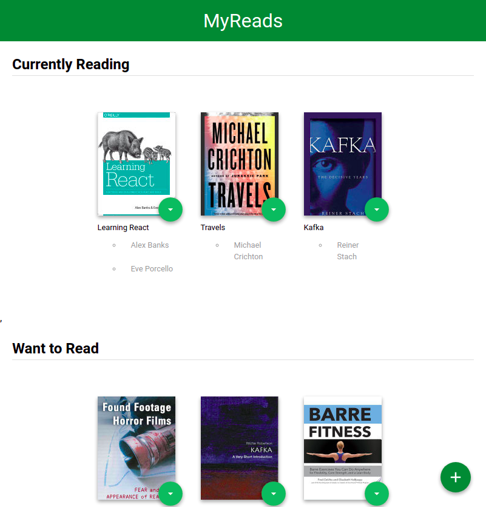
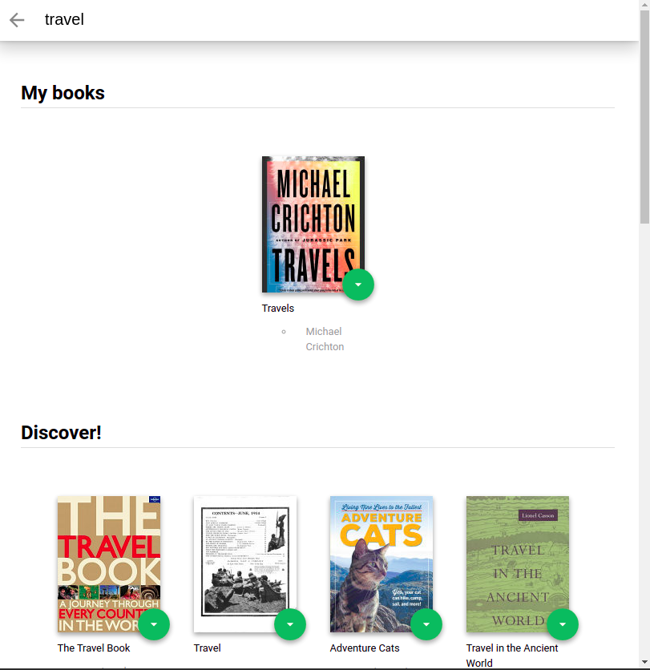

# MyReads Project

  


## Running tha app
```
npm install
```
```
npm run start
```


## functionality
- Main page displys the user's chosen books in three categories (Want to read, Reading, Read).
- Allow the user to move the books between the shielves
- Button links to the search page

- Search page uses ```search``` function provided by "https://reactnd-books-api.udacity.com" which search by book title and authors.
- User's books will be displyed in a shelf -My books- and new books in another one called -Discover-
